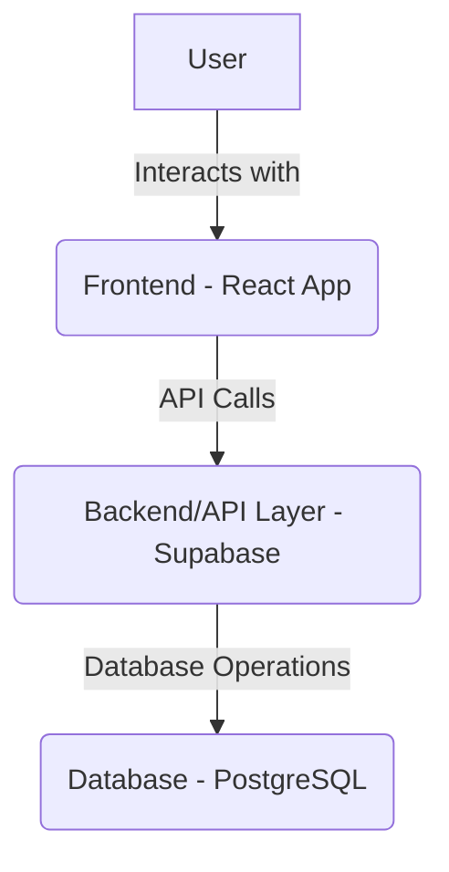

## 1. Architecture Design

## 2. Technology Description
- Frontend: React@18 (assumed based on common web-dev practices) + tailwindcss@3 (assumed) + vite (assumed)
- Backend/Database: Supabase (based on `supabase/migrations` folder) using PostgreSQL.
- Initialization Tool: vite-init (assumed)

## 3. Route Definitions
(To be determined based on existing website structure)

## 4. API Definitions (if backend exists)
Supabase provides its own API for database interaction. Specific API calls will depend on the data models.

## 5. Server Architecture Diagram (if backend exists)
Supabase handles the server architecture.

## 6. Data Model (if applicable)

### 6.1 Data Model Definition
(To be determined after database verification)

### 6.2 Data Definition Language
(DDL statements will be generated based on required updates)