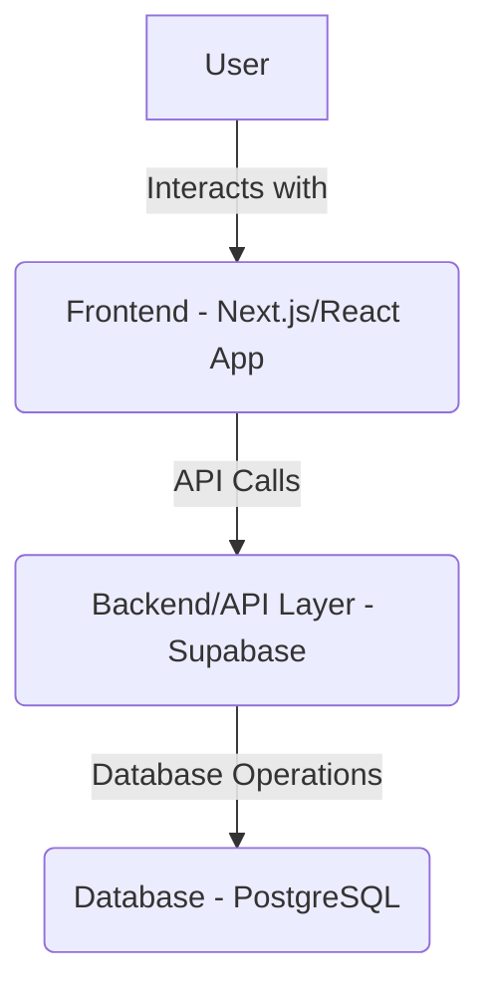

## 1. Architecture Design
(Will remain largely the same, but with emphasis on modern frontend practices and potential new backend services if features require it).

## 2. Technology Description
- Frontend: Next.js (React), Tailwind CSS, Framer Motion (for animations).
- Backend/Database: Supabase (PostgreSQL).
- (Potentially add other libraries/tools if new features necessitate them, e.g., for analytics, payment gateways, etc.)

## 3. Route Definitions
(Will be updated to reflect any new pages or reorganized structure).

## 4. API Definitions
(Will be updated to reflect any new backend functionalities required for new features).

## 5. Server Architecture Diagram
(Remains largely Supabase-centric unless custom backend services are introduced).

## 6. Data Model
(Will be extended if new features require additional data storage).